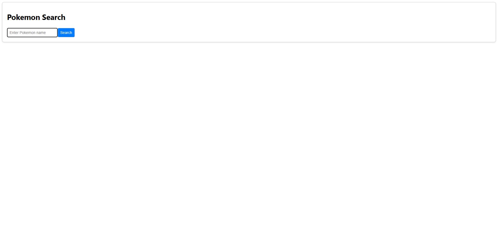
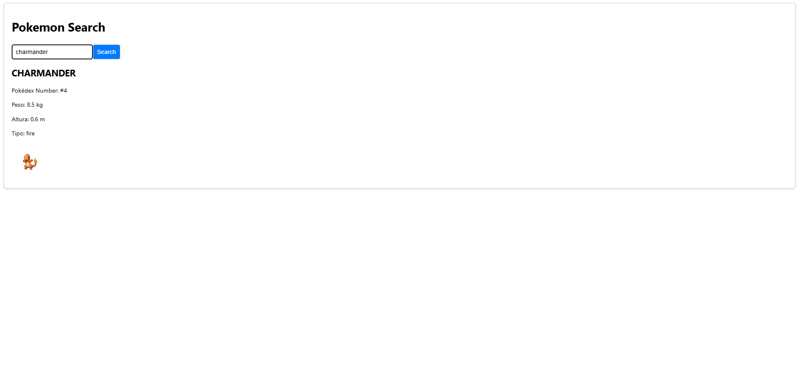

POKEDEX - Aplicativo React

Descrição

A POKEDEX é um aplicativo desenvolvido em React.js que permite aos usuários pesquisar informações sobre qualquer Pokémon utilizando a PokeAPI. Basta inserir o nome do Pokémon desejado para obter detalhes como:

Número na Pokédex

Altura e Peso

Tipos

Imagem Oficial

Caso o Pokémon não seja encontrado, a aplicação exibirá um alerta de erro.

🌟 Funcionalidades

🔎 Busca rápida de Pokémons pelo nome.

🗃️ Exibição detalhada das informações de cada Pokémon.

⚠️ Indicação de erro caso o Pokémon não seja encontrado.

🛠 Tecnologias Utilizadas

React.js ⚛️

Fetch API 🌐

CSS 🎨

🚀 Como Usar

1. Clonar o repositório:

git clone https://github.com/eduardocintr/pokedex2.git

2. Acessar o diretório do projeto:

cd pokedex

3. Instalar as dependências:

npm install

4. Iniciar a aplicação:

 npm start

5. Acessar no navegador:

Abra: http://localhost:3000

Digite o nome de um Pokémon e clique em "Search" para visualizar suas informações.

📸 Exemplo de Interface

